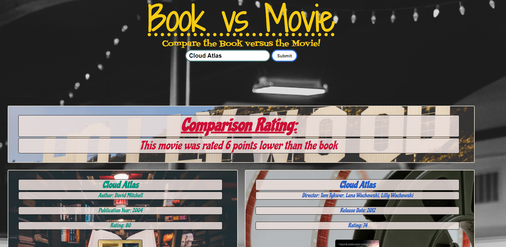

# Book vs Movie

## Description
### In this project we leveraged the goodreads api, and the omdb api to compare ratings of books and ratings of movies.
### We converted the ratings to a scale out of 100.
### We use the bulma CSS Framework. 
### Example Below: 

### Immediately noticable in this application is the pessimism of goodreads toward older works. 
### For example Romeo and Juliet will score a 60 as a book/play, and 76 as a movie. This will cause our app to say the movie is 16 points better than the book/play
### So the best way to use this app is "Which work do the modern-day reviewers of goodreads and omdb find more entertaining"